# MVP App, UML, dan Use Case - Djaitin

**Tanggal:** 2026-04-28  
**Basis evaluasi:** `docs/PRD.md`, `docs/MVP-READINESS.md`, route `/app`, route `/office`, model Eloquent, service order/payment, dan skema database saat ini.  
**Status:** MVP operasional layak, dengan catatan go-live dan beberapa cleanup non-blocking.
**Update:** 2026-05-24 — UC-17 s/d UC-20 ditambahkan; class diagram disinkronkan dengan kode aktual; OrderStatus ditambah `awaiting_price`.
**Revisi presentasi:** 2026-05-24 — seluruh diagram UML (use case, class, sequence, activity) ditulis ulang dengan bahasa Indonesia yang lebih mudah dibaca dan notasi UML standar (visibility `+/-/#`, format `atribut : Tipe`, `method() : Tipe`) sesuai panduan class diagram pada [Dicoding Blog — Memahami Class Diagram Lebih Baik](https://www.dicoding.com/blog/memahami-class-diagram-lebih-baik/). Cocok dipakai untuk presentasi mahasiswa informatika.

## 1. Ringkasan MVP

Djaitin saat ini sudah cukup untuk disebut **MVP operasional** karena alur inti dari PRD sudah tersedia:

| Area           | Kebutuhan PRD                                                            | Implementasi App                                                                           | Status MVP |
| -------------- | ------------------------------------------------------------------------ | ------------------------------------------------------------------------------------------ | ---------- |
| Public surface | Landing, login/register, service pages                                   | `/app`, catalog, service tailor/RTW/convection, auth Fortify                               | Siap       |
| Customer app   | Dashboard, profile, alamat, ukuran, order, payment, notification         | Route customer di `/app` dengan middleware `auth` dan `role:customer`                      | Siap       |
| Tailor         | Configurator, draft, order, DP 50%, payment gate                         | Tailor configurator, draft submit, minimum DP validation, payment record                   | Siap       |
| Ready-to-wear  | Catalog, cart, checkout, stok, delivery/pickup, ongkir kurir             | Product, cart, checkout, shipment, courier `base_fee`, stock decrement on verified payment | Siap       |
| Convection     | Order jumlah besar, attachment, full payment before production           | Convection order service mewajibkan total item dan pembayaran penuh                        | Siap       |
| Office app     | Dashboard, customer, order, payment, production, shipping, report, audit | Route `/office` mencakup semua area tersebut                                               | Siap       |
| Admin          | User, product, garment model, fabric, courier, discount                  | Resource admin di `/office/admin/*`                                                        | Siap       |
| Documents      | Nota, kwitansi, export report                                            | Document controller untuk nota/kwitansi dan report export                                  | Siap       |
| Notification   | Payment/order status untuk customer terkait                              | Laravel notifications untuk payment verified/rejected dan status penting                   | Siap       |
| Auditability   | Catatan perubahan penting                                                | `audit_logs` polymorphic ke order/payment/entity lain                                      | Siap       |

Kesimpulan: **sistem sudah mirip dan selaras dengan dokumen PRD MVP**. Yang perlu dipahami, MVP bukan berarti seluruh proses bisnis sudah sempurna untuk skala besar. MVP berarti customer, kasir, produksi, admin, dan owner sudah dapat menjalankan alur inti dalam satu sistem dengan batasan operasional yang jelas.

## 2. Batasan MVP

Fitur yang dianggap masuk MVP:

| Modul            | Scope                                                                                                                                                                                            |
| ---------------- | ------------------------------------------------------------------------------------------------------------------------------------------------------------------------------------------------ |
| Customer portal  | Registrasi, login, dashboard, profile, alamat, ukuran, order tailor, order RTW, order konveksi, payment proof, riwayat order, notification                                                       |
| Office operation | Customer management, order management, manual tailor order, payment verify/reject, production board, shipping, reports, audit log                                                                |
| Admin operation  | User internal, produk RTW, kain, model pakaian, courier, discount policy                                                                                                                         |
| Business rule    | DP tailor minimal 50% saat order dicatat, konveksi harus lunas sebelum produksi, ongkir RTW dari courier, RTW stock turun setelah payment verified, nota/kwitansi hanya setelah payment verified |
| Documentation    | PRD, readiness, manual user, go-live checklist, release notes, deployment runbook                                                                                                                |

Yang **bukan** target MVP:

| Area                               | Alasan                                                            |
| ---------------------------------- | ----------------------------------------------------------------- |
| Multi-branch inventory             | Belum dibutuhkan untuk validasi operasi awal                      |
| Integrasi payment gateway otomatis | MVP masih valid dengan cash dan transfer manual                   |
| Integrasi ekspedisi real-time      | Shipping masih cukup menggunakan courier, resi, dan status manual |
| CRM/marketing automation           | Di luar kebutuhan operasional inti PRD                            |
| Accounting lengkap                 | MVP hanya mencakup payment, kwitansi, report operasional          |
| Mobile native app                  | Customer app web mobile sudah cukup untuk MVP                     |

## 3. Catatan Kesesuaian dengan PRD

| PRD Rule                                                   | Implementasi Saat Ini                                                                                  | Catatan                                                             |
| ---------------------------------------------------------- | ------------------------------------------------------------------------------------------------------ | ------------------------------------------------------------------- |
| Customer hanya melihat data miliknya                       | Route customer memakai `auth` dan `role:customer`; controller/service memakai customer terkait user    | Perlu tetap diuji lewat feature test untuk setiap endpoint sensitif |
| Staff office tidak menjadi customer portal                 | Role helper memisahkan `canAccessCustomer()` dan `canAccessOffice()`                                   | Selaras                                                             |
| Tailor dicatat dengan DP awal minimal 50%                  | Customer dan office tailor flow menolak payment amount di bawah 50% total                              | Selaras                                                             |
| Tailor masuk produksi setelah DP minimal 50% terverifikasi | Payment service menghitung paid/outstanding; order status service melakukan gate sebelum `in_progress` | Selaras                                                             |
| Konveksi masuk produksi setelah lunas terverifikasi        | `ConvectionOrderService::validateFullPaymentGate()`                                                    | Selaras                                                             |
| RTW delivery tidak menambah biaya selain ongkir jasa kirim | Checkout memakai `base_fee` dari master courier sebagai `shipping_cost`                                | Selaras                                                             |
| RTW stock turun setelah verified payment                   | `PaymentService` memanggil stock decrement saat payment verified pertama                               | Selaras                                                             |
| Nota/kwitansi hanya setelah payment verified               | Route dokumen tersedia; controller menolak akses tanpa payment verified                                | Selaras                                                             |
| Nota Pesanan memuat tanggal selesai                        | Nota menampilkan `due_date` sebagai target selesai jika tersedia                                       | Selaras                                                             |
| Notification untuk customer terkait                        | Payment verification/rejection mengirim notifikasi ke user customer order                              | Selaras                                                             |

Catatan teknis non-blocking: model `Order` masih menyimpan field kompatibilitas lama seperti `quotation_notes`, `quoted_by`, dan `quoted_at`. Flow RFQ/quotation tidak aktif di customer atau office, sehingga tidak menjadi bagian baseline PRD.

## 4. Aktor Sistem

| Aktor    | Peran                                                                                            |
| -------- | ------------------------------------------------------------------------------------------------ |
| Guest    | Melihat landing, layanan, katalog, lalu registrasi/login                                         |
| Customer | Membuat order, mengelola profil, membayar sesuai rule, melihat status, menerima notifikasi       |
| Kasir    | Mencatat order manual, mencatat payment cash/transfer, memverifikasi transfer, mencetak kwitansi |
| Produksi | Memantau order aktif dan memperbarui status produksi                                             |
| Admin    | Mengelola master data, user, produk, report, audit                                               |
| Owner    | Melihat dashboard, report, audit log, dan kondisi operasional                                    |

## 5. Daftar Use Case

Daftar berikut adalah ringkasan use case sistem Djaitin. Setiap use case dijelaskan secara naratif sehingga mudah disampaikan saat presentasi.

| ID    | Use Case                               | Aktor Utama      | Tujuan Singkat                                                   | Hasil Akhir                                                        |
| ----- | -------------------------------------- | ---------------- | ---------------------------------------------------------------- | ------------------------------------------------------------------ |
| UC-01 | Registrasi & Login                     | Tamu, Pelanggan  | Membuat akun baru atau masuk ke portal pelanggan                 | Akun pelanggan aktif beserta profil dasarnya tersedia              |
| UC-02 | Mengelola Profil Pelanggan             | Pelanggan        | Menyimpan kontak, alamat, dan ukuran badan                       | Data pelanggan, alamat, dan ukuran tersimpan                       |
| UC-03 | Mengatur Konfigurasi Jahit             | Pelanggan        | Mendesain pesanan jahit melalui wizard tailor                    | Rancangan pesanan jahit terbentuk                                  |
| UC-04 | Mengirim Pesanan Jahit                 | Pelanggan        | Mengirim pesanan jahit dengan DP minimal 50%                     | Pesanan jahit berstatus "menunggu pembayaran"                      |
| UC-05 | Membeli Produk Siap Pakai              | Pelanggan        | Memilih produk, mengisi keranjang, lalu checkout                 | Pesanan ready-to-wear beserta itemnya tercatat                     |
| UC-06 | Mengajukan Pesanan Konveksi            | Pelanggan        | Membuat pesanan jumlah besar lengkap dengan referensi desain     | Pesanan konveksi, item, lampiran, dan pembayaran tercatat          |
| UC-07 | Mengunggah Bukti Pembayaran            | Pelanggan        | Mengirim bukti transfer atau mengganti bukti yang ditolak        | Pembayaran berstatus "menunggu verifikasi"                         |
| UC-08 | Memantau Riwayat Pesanan               | Pelanggan        | Melihat status pesanan dan rincian pembayaran                    | Detail pesanan dan status terbaru                                  |
| UC-09 | Mengelola Data Pelanggan               | Kasir, Admin     | Mencatat atau memperbarui pelanggan offline                      | Data pelanggan dan ukuran tersimpan                                |
| UC-10 | Membuat Pesanan Jahit Manual           | Kasir            | Mencatat pesanan dari pelanggan yang datang langsung             | Pesanan jahit tercatat dari sisi kantor                            |
| UC-11 | Memverifikasi Pembayaran               | Kasir, Admin     | Menyetujui atau menolak bukti transfer                           | Pembayaran terverifikasi/ditolak dan pelanggan menerima notifikasi |
| UC-12 | Mencetak Dokumen Transaksi             | Kasir, Admin     | Membuat nota dan kwitansi setelah pembayaran sah                 | Dokumen PDF nota / kwitansi                                        |
| UC-13 | Memperbarui Status Produksi            | Produksi, Admin  | Memindahkan pesanan antar tahap produksi                         | Status pesanan / tahap produksi berubah                            |
| UC-14 | Mengelola Pengiriman                   | Kasir, Admin     | Memilih kurir, resi, dan status pengiriman                       | Data pengiriman terbaru                                            |
| UC-15 | Mengelola Master Data                  | Admin            | Mengatur user internal, produk, kain, model, kurir, dan diskon   | Master data siap dipakai                                           |
| UC-16 | Melihat Laporan & Audit                | Admin, Pemilik   | Memantau omzet, pesanan, pembayaran, dan perubahan penting       | Laporan / ekspor dan jejak audit                                   |
| UC-17 | Mengaktifkan Two-Factor Authentication | Pelanggan, Staf  | Menambah lapisan keamanan akun via Fortify                       | Fitur 2FA aktif pada akun                                          |
| UC-18 | Menyimpan / Melanjutkan Draft          | Pelanggan        | Menyimpan konfigurasi tailor sebagai draft sebelum dikirim       | Draft pesanan tersimpan dalam payload jsonb                        |
| UC-19 | Membatalkan Pesanan                    | Pelanggan, Admin | Membatalkan pesanan disertai alasan dan jejak audit              | Pesanan berstatus "dibatalkan" beserta alasan dan pembatal         |
| UC-20 | Meninjau Lampiran Konveksi             | Kasir, Admin     | Meninjau lampiran desain (referensi → proposal → revisi → final) | Status persetujuan lampiran terbaru                                |

## 6. Diagram Use Case

```mermaid
flowchart LR
    Tamu((Tamu))
    Pelanggan((Pelanggan))
    Kasir((Kasir))
    Produksi((Produksi))
    Admin((Admin))
    Pemilik((Pemilik))

    subgraph Publik["Halaman Publik"]
        UC01["UC-01 Registrasi & Login"]
        UC00["Melihat Landing, Layanan, Katalog"]
    end

    subgraph AppPelanggan["Aplikasi Pelanggan (/app)"]
        UC02["UC-02 Mengelola Profil, Alamat, Ukuran"]
        UC03["UC-03 Mengatur Konfigurasi Jahit"]
        UC04["UC-04 Mengirim Pesanan Jahit"]
        UC05["UC-05 Checkout Produk Siap Pakai"]
        UC06["UC-06 Mengirim Pesanan Konveksi"]
        UC07["UC-07 Mengunggah Bukti Pembayaran"]
        UC08["UC-08 Memantau Pesanan & Notifikasi"]
        UC17["UC-17 Mengaktifkan Two-Factor Authentication"]
        UC18["UC-18 Menyimpan / Melanjutkan Draft"]
        UC19["UC-19 Membatalkan Pesanan"]
    end

    subgraph AppKantor["Aplikasi Kantor (/office)"]
        UC09["UC-09 Mengelola Data Pelanggan"]
        UC10["UC-10 Membuat Pesanan Jahit Manual"]
        UC11["UC-11 Memverifikasi / Menolak Pembayaran"]
        UC12["UC-12 Mencetak Nota / Kwitansi"]
        UC13["UC-13 Memperbarui Status Produksi"]
        UC14["UC-14 Mengelola Pengiriman"]
        UC16["UC-16 Laporan & Audit"]
        UC17O["UC-17 Mengaktifkan Two-Factor Authentication"]
        UC19O["UC-19 Membatalkan Pesanan"]
        UC20["UC-20 Meninjau Lampiran Konveksi"]
    end

    subgraph ModulAdmin["Modul Admin (/office/admin)"]
        UC15["UC-15 Mengelola User, Produk, Kain, Model, Kurir, Diskon"]
    end

    Tamu --> UC00
    Tamu --> UC01
    Pelanggan --> UC02
    Pelanggan --> UC03
    Pelanggan --> UC04
    Pelanggan --> UC05
    Pelanggan --> UC06
    Pelanggan --> UC07
    Pelanggan --> UC08
    Pelanggan --> UC17
    Pelanggan --> UC18
    Pelanggan --> UC19
    Kasir --> UC09
    Kasir --> UC10
    Kasir --> UC11
    Kasir --> UC12
    Kasir --> UC14
    Kasir --> UC17O
    Kasir --> UC20
    Produksi --> UC13
    Produksi --> UC17O
    Admin --> UC09
    Admin --> UC10
    Admin --> UC11
    Admin --> UC12
    Admin --> UC13
    Admin --> UC14
    Admin --> UC17O
    Admin --> UC19O
    Admin --> UC20
    Admin --> UC15
    Admin --> UC16
    Pemilik --> UC17O
    Pemilik --> UC16
```

## 7. Diagram Konteks Sistem

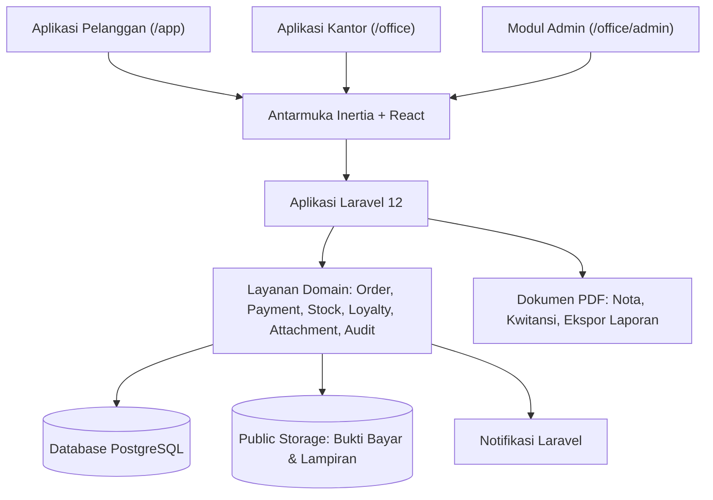

## 8. Diagram Kelas (Class Diagram)

> **Cara membaca diagram kelas berdasarkan panduan [Dicoding — Memahami Class Diagram Lebih Baik](https://www.dicoding.com/blog/memahami-class-diagram-lebih-baik/):**
>
> Setiap kelas terdiri dari tiga bagian: **nama kelas** (atas), **atribut** (tengah), dan **operasi/method** (bawah). Tanda `+` artinya `public` (bisa diakses dari luar), `-` artinya `private` (hanya internal), dan `#` artinya `protected`. Format atribut ditulis `nama : Tipe`, sedangkan method ditulis `nama() : Tipe`.
>
> **Tiga jenis hubungan antar kelas yang dipakai:**
>
> - **Asosiasi** (garis lurus `--`): hubungan biasa antar kelas. Contoh: `Pelanggan` punya `Alamat`.
> - **Agregasi** (belah ketupat kosong `o--`): salah satu kelas adalah bagian dari yang lain, tapi tetap bisa berdiri sendiri. Contoh: `Keranjang` mengelompokkan `ItemKeranjang`.
> - **Komposisi** (belah ketupat penuh `*--`): bagian yang tidak bisa hidup tanpa induknya. Contoh: `Pesanan` punya `ItemPesanan` (item akan ikut hilang kalau pesanan dihapus).
> - **Pewarisan / Generalisasi** (panah segitiga kosong `<|--`): subclass mewarisi atribut dan method dari superclass.
>
> **Multiplisitas** (`1`, `0..1`, `1..*`, `0..*`) dipasang di kedua ujung relasi untuk menunjukkan banyaknya objek yang terlibat.

### 8.1 Diagram Kelas Inti — Pelanggan, Pesanan, Pembayaran

Diagram ini fokus pada alur utama bisnis Djaitin: pelanggan membuat pesanan, pesanan memiliki item dan pembayaran, lalu pesanan dikirim atau diambil.

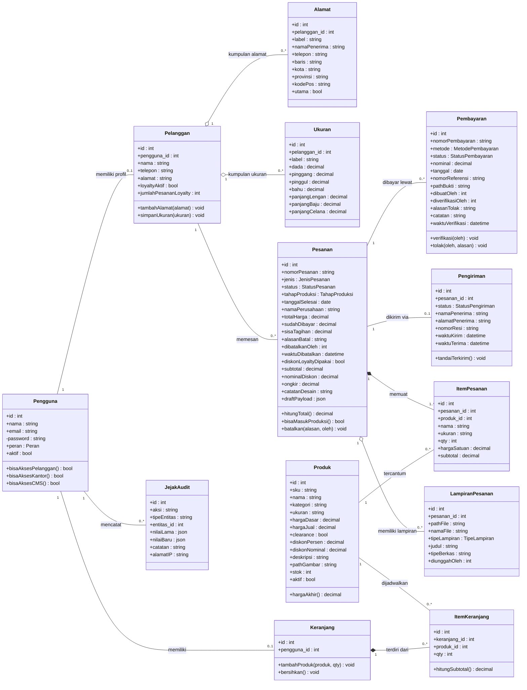

### 8.2 Diagram Kelas — Master Data dan Enumerasi

Kelompok ini berisi master data yang dipakai pesanan dan kumpulan enumerasi yang menjadi referensi status di seluruh sistem.

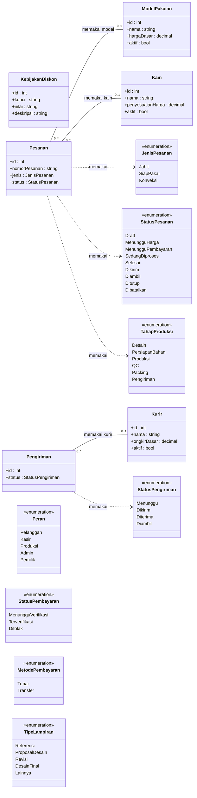

### 8.3 Diagram Kelas — Layanan Domain (Service Layer)

Diagram ini menggambarkan layanan domain yang menjalankan aturan bisnis. Class kontrol seperti ini berperan sebagai "otak" sistem, sesuai pola MVC yang dijelaskan oleh Dicoding (interface, control, entity).

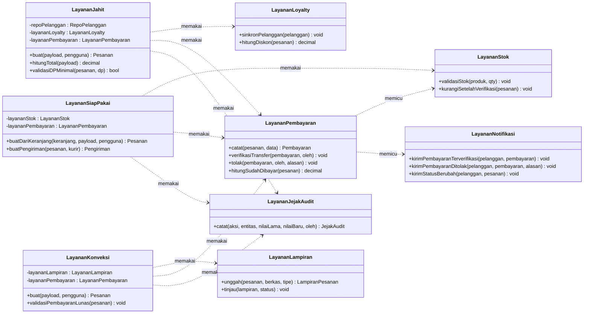

## 9. Diagram Sekuens — Pesanan Jahit dari Pelanggan

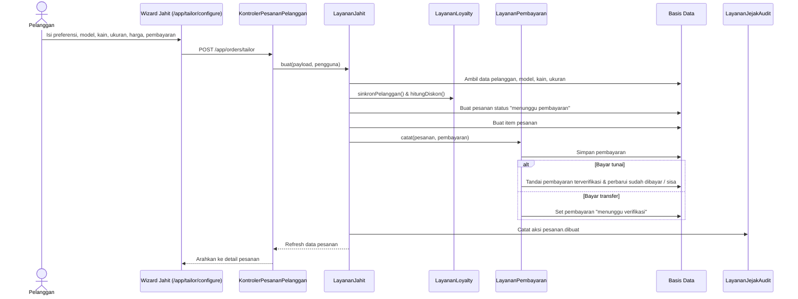

## 10. Diagram Sekuens — Checkout Produk Siap Pakai

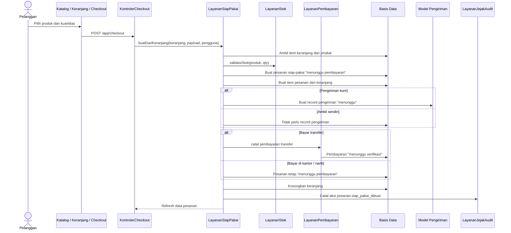

## 11. Diagram Sekuens — Pesanan Konveksi (Pelunasan Penuh)

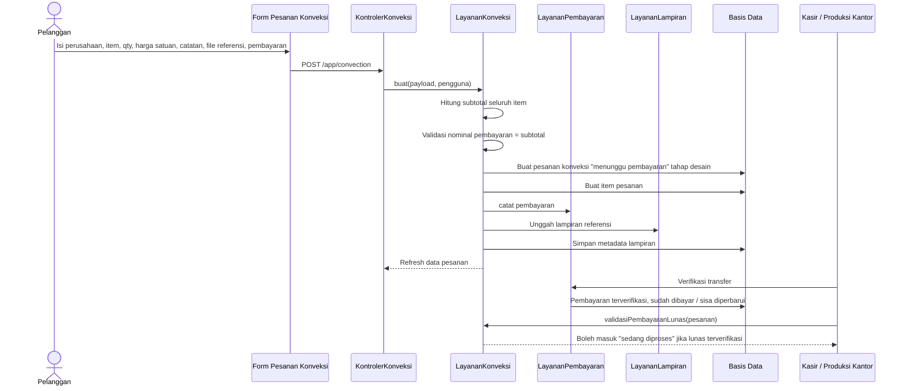

## 12. Diagram Sekuens — Verifikasi Pembayaran oleh Kasir

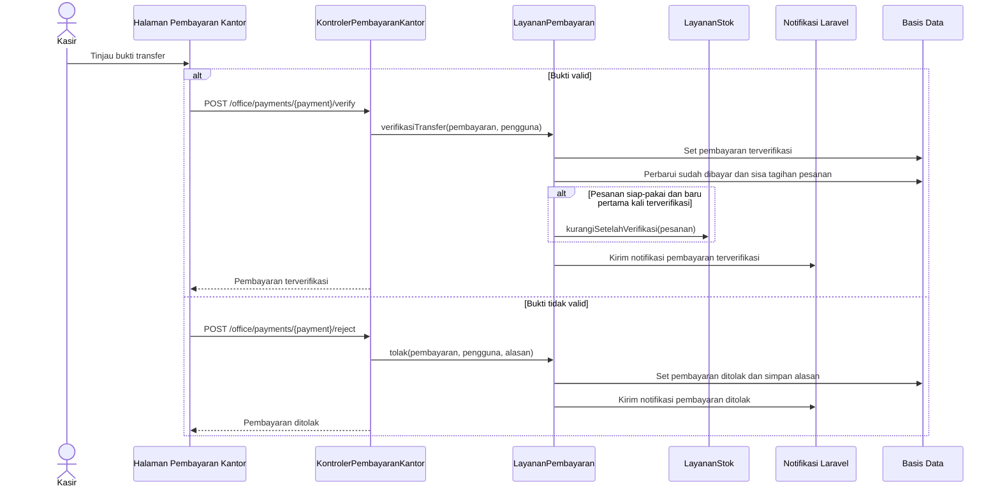

## 13. Diagram Sekuens — Produksi dan Pengiriman

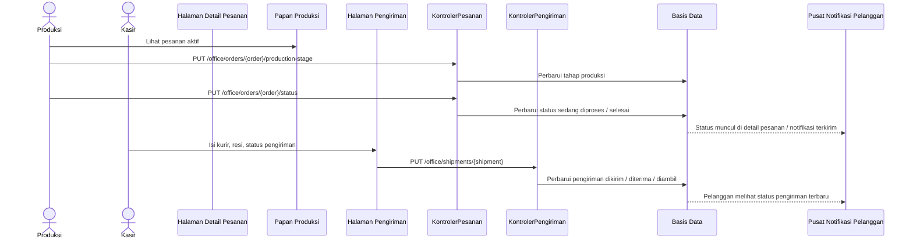

## 14. Diagram Aktivitas (Swimlane) — Alur Pesanan Pelanggan

> **Format swimlane UML.** Setiap kolom (lane) mewakili satu aktor; alur aktivitas mengalir dari atas ke bawah dalam masing-masing lane dan berpindah antar lane saat tanggung jawab berpindah.
>
> **Aktor (lane):** Pelanggan · Sistem · Kantor (Kasir / Produksi / Pengiriman)

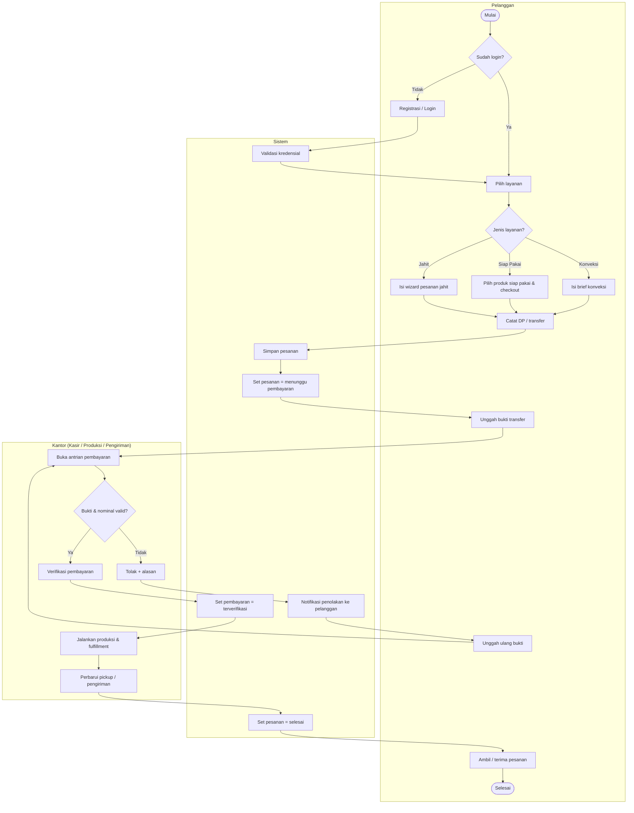

## 15. Diagram Aktivitas (Swimlane) — Verifikasi Pembayaran di Kantor

> **Aktor (lane):** Pelanggan · Sistem · Kasir

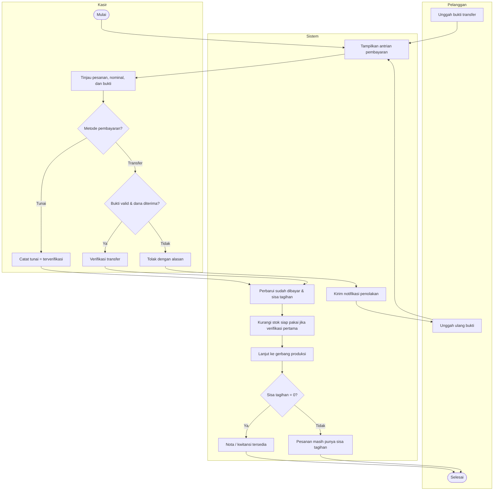

## 16. Diagram Aktivitas (Swimlane) — Produksi & Fulfillment

> **Aktor (lane):** Pelanggan · Sistem · Kantor (Produksi / Pengiriman)

```mermaid
flowchart TB
    subgraph PEL["Pelanggan"]
        direction LR
        cMode{Metode pengambilan?}
        cPickup[Pelanggan ambil pesanan]
        cTerima[Pelanggan terima pengiriman]
        cSelesai([Selesai])
    end

    subgraph SIS["Sistem"]
        direction LR
        sMulai([Mulai])
        sJenis{Jenis pesanan?}
        sJahitDP{DP &ge; 50% terverifikasi?}
        sKonvLunas{Lunas terverifikasi?}
        sRTWBayar{Pembayaran terverifikasi?}
        sHold[Tahan di "menunggu pembayaran"]
        sProses[Set status = sedang diproses]
        sDone[Set pesanan = selesai]
        sShipped[Set dikirim / diterima]
        sClosed[Set diambil / ditutup]
    end

    subgraph KAN["Kantor (Produksi / Pengiriman)"]
        direction LR
        oRTW[Picking & packing produk siap pakai]
        oStage[Perbarui tahap produksi]
        oQC{QC selesai?}
        oShip[Isi kurir & resi pengiriman]
    end

    sMulai --> sJenis
    sJenis -- Jahit --> sJahitDP
    sJenis -- Konveksi --> sKonvLunas
    sJenis -- Siap Pakai --> sRTWBayar
    sJahitDP -- Tidak --> sHold
    sKonvLunas -- Tidak --> sHold
    sRTWBayar -- Tidak --> sHold
    sJahitDP -- Ya --> sProses
    sKonvLunas -- Ya --> sProses
    sRTWBayar -- Ya --> oRTW --> sDone
    sProses --> oStage --> oQC
    oQC -- Tidak --> oStage
    oQC -- Ya --> sDone
    sDone --> cMode
    cMode -- Ambil sendiri --> cPickup --> sClosed --> cSelesai
    cMode -- Pengiriman --> oShip --> sShipped --> cTerima --> cSelesai
```

## 17. Status Route MVP

| Surface                | Route Utama                                                                      | Fungsi                                                 |
| ---------------------- | -------------------------------------------------------------------------------- | ------------------------------------------------------ |
| Customer public        | `/app`, `/app/catalog`, `/app/services/*`, `/app/tailor/configure`               | Landing customer, katalog, service page, wizard tailor |
| Customer auth          | `/app/dashboard`, `/app/profile`, `/app/addresses`, `/app/measurements`          | Dashboard dan profile center                           |
| Customer orders        | `/app/orders`, `/app/orders/{order}`, `/app/orders/tailor`, `/app/convection`    | Riwayat, detail, tailor, konveksi                      |
| Customer cart/checkout | `/app/cart`, `/app/checkout`                                                     | RTW commerce                                           |
| Customer payment       | `/app/payments`, `/app/orders/{order}/payments`, `/app/payments/{payment}/proof` | Payment history dan upload proof                       |
| Customer notification  | `/app/notifications`                                                             | Notification center                                    |
| Office dashboard       | `/office/dashboard`                                                              | Ringkasan operasional                                  |
| Office orders          | `/office/orders`, `/office/orders/{order}`, `/office/orders/tailor/create`       | Order list, detail, manual tailor                      |
| Office payments        | `/office/payments`, verify/reject, kwitansi                                      | Queue pembayaran dan dokumen                           |
| Office production      | `/office/production`                                                             | Production board                                       |
| Office shipping        | `/office/shipping`, `/office/shipments/{shipment}`                               | Shipment management                                    |
| Office reports         | `/office/reports`, `/office/reports/export`                                      | Report dan export                                      |
| Office audit           | `/office/audit-log`                                                              | Audit trail                                            |
| Admin                  | `/office/admin/users`, products, garment-models, fabrics, couriers, discounts    | Master data dan policy                                 |

## 18. MVP Acceptance Criteria

| Area                   | Acceptance Criteria                                                                                                     |
| ---------------------- | ----------------------------------------------------------------------------------------------------------------------- |
| Auth & Role            | Customer tidak bisa akses `/office`; staff office tidak diperlakukan sebagai customer portal                            |
| Customer Profile       | Customer dapat menyimpan alamat default dan measurement untuk order berikutnya                                          |
| Tailor                 | Customer atau kasir dapat membuat tailor order hanya jika DP awal minimal 50%; payment tercatat; order muncul di office |
| Ready-to-Wear          | Customer dapat checkout cart; stok hanya turun setelah payment verified                                                 |
| Ready-to-Wear Delivery | Ongkir berasal dari master courier dan dicatat ke order/shipment tanpa fee tambahan hardcoded                           |
| Convection             | Customer hanya bisa submit jika total item valid dan full payment sesuai total                                          |
| Payment                | Transfer bisa verified/rejected; rejection reason tersimpan; customer bisa upload ulang proof                           |
| Production             | Office dapat update status dan stage produksi sesuai gate pembayaran                                                    |
| Shipping               | Office dapat mengisi courier, resi, dan status shipment                                                                 |
| Documents              | Nota/kwitansi tersedia hanya untuk transaksi yang valid sesuai rule                                                     |
| Report & Audit         | Admin/owner dapat melihat report dan audit log perubahan penting                                                        |

## 19. Risiko dan Cleanup Non-Blocking

| Item                                            | Dampak                                                               | Rekomendasi                                                                            |
| ----------------------------------------------- | -------------------------------------------------------------------- | -------------------------------------------------------------------------------------- |
| Field quotation legacy masih ada di `orders`    | Tidak muncul di flow aktif, tetapi bisa membingungkan developer baru | Dokumentasikan sebagai kompatibilitas lama atau cleanup setelah data production stabil |
| Transfer manual masih bergantung pada SOP kasir | Risiko human error                                                   | Buat checklist kasir dan audit rutin harian                                            |
| Courier/shipping belum integrasi API ekspedisi  | Tracking belum otomatis                                              | Masuk roadmap post-MVP, bukan blocker narasi                                           |
| Payment gateway belum otomatis                  | Verifikasi masih manual                                              | Masuk roadmap jika volume transaksi meningkat                                          |
| Testing harus dijaga setelah perubahan besar    | Readiness lama bisa kadaluarsa                                       | Jalankan `php artisan test --compact`, `npm run build`, dan type check sebelum go-live |

## 20. Rekomendasi Go-Live MVP

1. Gunakan MVP untuk operasi terbatas terlebih dahulu, misalnya customer internal atau customer terpilih.
2. Kunci SOP kasir: transfer baru verified setelah dana diterima atau bukti valid sesuai catatan bisnis.
3. Kunci SOP produksi: tailor minimal DP 50% verified, konveksi lunas verified sebelum produksi.
4. Kunci SOP shipping: resi dan status wajib diinput sebelum order dianggap shipped/delivered.
5. Jalankan verifikasi teknis sebelum release: backend test, frontend build, storage link, mail/notification, APP_URL, backup database.
6. Buat backlog post-MVP untuk payment gateway, ekspedisi API, inventory lanjutan, dan accounting.

## 21. Verdict Akhir

Berdasarkan PRD dan struktur app saat ini, Djaitin sudah memenuhi bentuk **MVP aplikasi SIM Convection Taylor**:

| Pertanyaan                                    | Jawaban                                                                      |
| --------------------------------------------- | ---------------------------------------------------------------------------- |
| Apakah sudah bisa menjadi MVP?                | Ya, untuk MVP operasional dengan scope terkontrol                            |
| Apakah sudah mirip docs/PRD?                  | Ya, mayoritas surface dan business rule inti sudah selaras                   |
| Apakah sudah production mature?               | Belum sepenuhnya; perlu go-live checklist, SOP, backup, dan QA final         |
| Apakah ada fitur berlebihan yang menghalangi? | Tidak. Fitur modern diposisikan sebagai pendukung UX, bukan flow bisnis inti |

Dokumen ini dapat dipakai sebagai acuan visual dan teknis untuk menjelaskan MVP kepada stakeholder, dosen/penguji, tim developer, atau tim operasional.
