# MVP App, UML, dan Use Case - Djaitin

**Tanggal:** 2026-04-28  
**Basis evaluasi:** `docs/PRD.md`, `docs/MVP-READINESS.md`, route `/app`, route `/office`, model Eloquent, service order/payment, dan skema database saat ini.  
**Status:** MVP operasional layak, dengan catatan go-live dan beberapa cleanup non-blocking.

## 1. Ringkasan MVP

Djaitin saat ini sudah cukup untuk disebut **MVP operasional** karena alur inti dari PRD sudah tersedia:

| Area | Kebutuhan PRD | Implementasi App | Status MVP |
| --- | --- | --- | --- |
| Public surface | Landing, login/register, service pages | `/app`, catalog, service tailor/RTW/convection, auth Fortify | Siap |
| Customer app | Dashboard, profile, alamat, ukuran, order, payment, notification | Route customer di `/app` dengan middleware `auth` dan `role:customer` | Siap |
| Tailor | Configurator, draft, order, DP 50%, payment gate | Tailor configurator, draft submit, minimum DP validation, payment record | Siap |
| Ready-to-wear | Catalog, cart, checkout, stok, delivery/pickup, ongkir kurir | Product, cart, checkout, shipment, courier `base_fee`, stock decrement on verified payment | Siap |
| Convection | Order jumlah besar, attachment, full payment before production | Convection order service mewajibkan total item dan pembayaran penuh | Siap |
| Office app | Dashboard, customer, order, payment, production, shipping, report, audit | Route `/office` mencakup semua area tersebut | Siap |
| Admin | User, product, garment model, fabric, courier, discount | Resource admin di `/office/admin/*` | Siap |
| Documents | Nota, kwitansi, export report | Document controller untuk nota/kwitansi dan report export | Siap |
| Notification | Payment/order status untuk customer terkait | Laravel notifications untuk payment verified/rejected dan status penting | Siap |
| Auditability | Catatan perubahan penting | `audit_logs` polymorphic ke order/payment/entity lain | Siap |

Kesimpulan: **sistem sudah mirip dan selaras dengan dokumen PRD MVP**. Yang perlu dipahami, MVP bukan berarti seluruh proses bisnis sudah sempurna untuk skala besar. MVP berarti customer, kasir, produksi, admin, dan owner sudah dapat menjalankan alur inti dalam satu sistem dengan batasan operasional yang jelas.

## 2. Batasan MVP

Fitur yang dianggap masuk MVP:

| Modul | Scope |
| --- | --- |
| Customer portal | Registrasi, login, dashboard, profile, alamat, ukuran, order tailor, order RTW, order konveksi, payment proof, riwayat order, notification |
| Office operation | Customer management, order management, manual tailor order, payment verify/reject, production board, shipping, reports, audit log |
| Admin operation | User internal, produk RTW, kain, model pakaian, courier, discount policy |
| Business rule | DP tailor minimal 50% saat order dicatat, konveksi harus lunas sebelum produksi, ongkir RTW dari courier, RTW stock turun setelah payment verified, nota/kwitansi hanya setelah payment verified |
| Documentation | PRD, readiness, manual user, go-live checklist, release notes, deployment runbook |

Yang **bukan** target MVP:

| Area | Alasan |
| --- | --- |
| Multi-branch inventory | Belum dibutuhkan untuk validasi operasi awal |
| Integrasi payment gateway otomatis | MVP masih valid dengan cash dan transfer manual |
| Integrasi ekspedisi real-time | Shipping masih cukup menggunakan courier, resi, dan status manual |
| CRM/marketing automation | Di luar kebutuhan operasional inti PRD |
| Accounting lengkap | MVP hanya mencakup payment, kwitansi, report operasional |
| Mobile native app | Customer app web mobile sudah cukup untuk MVP |

## 3. Catatan Kesesuaian dengan PRD

| PRD Rule | Implementasi Saat Ini | Catatan |
| --- | --- | --- |
| Customer hanya melihat data miliknya | Route customer memakai `auth` dan `role:customer`; controller/service memakai customer terkait user | Perlu tetap diuji lewat feature test untuk setiap endpoint sensitif |
| Staff office tidak menjadi customer portal | Role helper memisahkan `canAccessCustomer()` dan `canAccessOffice()` | Selaras |
| Tailor dicatat dengan DP awal minimal 50% | Customer dan office tailor flow menolak payment amount di bawah 50% total | Selaras |
| Tailor masuk produksi setelah DP minimal 50% terverifikasi | Payment service menghitung paid/outstanding; order status service melakukan gate sebelum `in_progress` | Selaras |
| Konveksi masuk produksi setelah lunas terverifikasi | `ConvectionOrderService::validateFullPaymentGate()` | Selaras |
| RTW delivery tidak menambah biaya selain ongkir jasa kirim | Checkout memakai `base_fee` dari master courier sebagai `shipping_cost` | Selaras |
| RTW stock turun setelah verified payment | `PaymentService` memanggil stock decrement saat payment verified pertama | Selaras |
| Nota/kwitansi hanya setelah payment verified | Route dokumen tersedia; controller menolak akses tanpa payment verified | Selaras |
| Nota Pesanan memuat tanggal selesai | Nota menampilkan `due_date` sebagai target selesai jika tersedia | Selaras |
| Notification untuk customer terkait | Payment verification/rejection mengirim notifikasi ke user customer order | Selaras |

Catatan teknis non-blocking: model `Order` masih menyimpan field kompatibilitas lama seperti `quotation_notes`, `quoted_by`, dan `quoted_at`. Flow RFQ/quotation tidak aktif di customer atau office, sehingga tidak menjadi bagian baseline PRD.

## 4. Aktor Sistem

| Aktor | Peran |
| --- | --- |
| Guest | Melihat landing, layanan, katalog, lalu registrasi/login |
| Customer | Membuat order, mengelola profil, membayar sesuai rule, melihat status, menerima notifikasi |
| Kasir | Mencatat order manual, mencatat payment cash/transfer, memverifikasi transfer, mencetak kwitansi |
| Produksi | Memantau order aktif dan memperbarui status produksi |
| Admin | Mengelola master data, user, produk, report, audit |
| Owner | Melihat dashboard, report, audit log, dan kondisi operasional |

## 5. Use Case List

| ID | Use Case | Aktor Utama | Tujuan | Output |
| --- | --- | --- | --- | --- |
| UC-01 | Registrasi dan login | Guest, Customer | Masuk ke portal customer | User customer aktif dan customer profile tersedia |
| UC-02 | Kelola profil customer | Customer | Menyimpan data kontak, alamat, dan ukuran | Customer, address, measurement tersimpan |
| UC-03 | Konfigurasi tailor order | Customer | Membuat order jahit eksploratif melalui wizard | Draft/order tailor terbentuk |
| UC-04 | Submit tailor order | Customer | Mengirim tailor order dengan DP minimal 50% | Order `tailor` status `pending_payment` |
| UC-05 | Beli ready-to-wear | Customer | Memilih produk, cart, checkout pickup/delivery | Order `ready_wear` dan item order |
| UC-06 | Ajukan order konveksi | Customer | Membuat order jumlah besar dengan referensi desain | Order `convection`, item, attachment, payment |
| UC-07 | Upload bukti pembayaran | Customer | Mengirim bukti transfer atau upload ulang bukti | Payment `pending_verification` |
| UC-08 | Lihat riwayat order | Customer | Memantau status order dan detail pembayaran | Order detail dan status terbaru |
| UC-09 | Kelola customer office | Kasir, Admin | Membuat/memperbarui data pelanggan offline | Customer dan measurement tersimpan |
| UC-10 | Buat tailor order manual | Kasir | Mencatat order dari customer yang datang langsung | Order tailor dari office |
| UC-11 | Verifikasi pembayaran | Kasir, Admin | Menyetujui atau menolak transfer | Payment verified/rejected dan notifikasi customer |
| UC-12 | Cetak dokumen transaksi | Kasir, Admin | Membuat nota dan kwitansi setelah payment valid | PDF nota/kwitansi |
| UC-13 | Update status produksi | Produksi, Admin | Memindahkan order antar tahap produksi | Status order atau production stage berubah |
| UC-14 | Kelola pengiriman | Kasir, Admin | Menambah courier, resi, status shipped/delivered/pickup | Shipment terbaru |
| UC-15 | Kelola master data | Admin | Mengatur user internal, produk, kain, model, courier, discount | Master data siap digunakan |
| UC-16 | Lihat laporan dan audit | Admin, Owner | Memantau omzet, order, payment, dan perubahan penting | Report/export dan audit trail |

## 6. Use Case Diagram

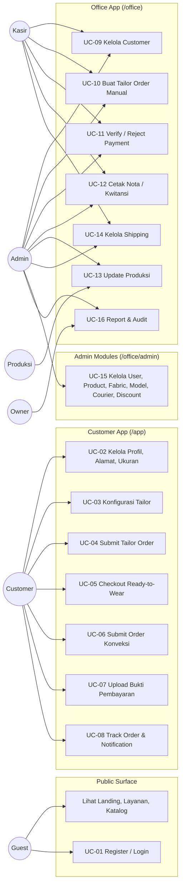

## 7. System Context Diagram

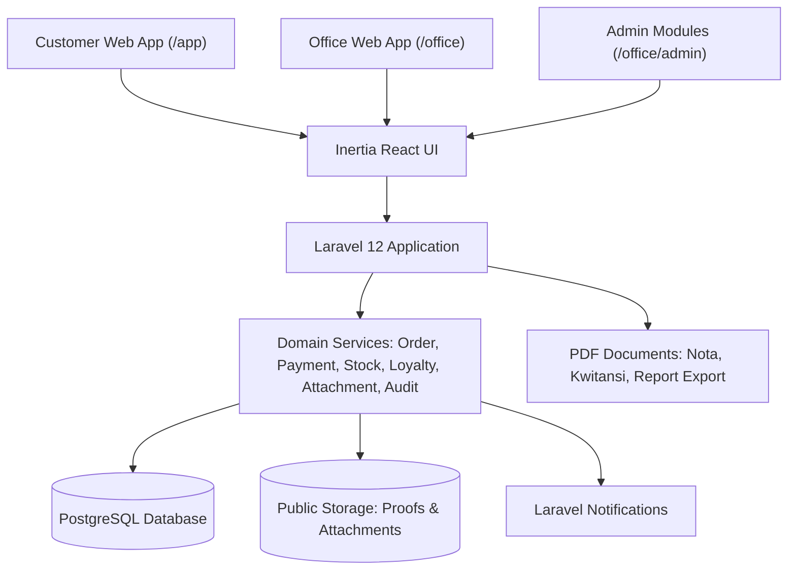

## 8. Class Diagram

```mermaid
classDiagram
    direction LR

    class User {
        +int id
        +string name
        +string email
        +UserRole role
        +bool is_active
        +canAccessCustomer() bool
        +canAccessOffice() bool
        +canAccessCms() bool
    }

    class Customer {
        +int id
        +int user_id
        +string name
        +string phone
        +string address
        +bool is_loyalty_eligible
        +int loyalty_order_count
    }

    class Address {
        +int id
        +int customer_id
        +string label
        +string recipient_name
        +string phone
        +string address_line
        +string city
        +string province
        +string postal_code
        +bool is_default
    }

    class Measurement {
        +int id
        +int customer_id
        +string label
        +decimal chest
        +decimal waist
        +decimal hips
        +decimal shoulder
        +decimal sleeve_length
        +decimal shirt_length
        +decimal inseam
        +decimal trouser_waist
    }

    class Cart {
        +int id
        +int user_id
    }

    class CartItem {
        +int id
        +int cart_id
        +int product_id
        +int qty
        +subtotalAmount() float
    }

    class Product {
        +int id
        +string sku
        +string name
        +string category
        +string size
        +decimal base_price
        +decimal selling_price
        +decimal discount_amount
        +int stock
        +bool is_active
        +finalPrice() float
    }

    class Order {
        +int id
        +string order_number
        +OrderType order_type
        +OrderStatus status
        +ProductionStage production_stage
        +date due_date
        +string company_name
        +decimal total_amount
        +decimal paid_amount
        +decimal outstanding_amount
        +json draft_payload
    }

    class OrderItem {
        +int id
        +int order_id
        +int product_id
        +string item_name
        +string size
        +int qty
        +decimal unit_price
        +decimal subtotal
    }

    class Payment {
        +int id
        +string payment_number
        +PaymentMethod method
        +PaymentStatus status
        +decimal amount
        +string reference_number
        +string proof_image_path
        +datetime verified_at
    }

    class Shipment {
        +int id
        +ShipmentStatus status
        +string recipient_name
        +string recipient_address
        +string tracking_number
        +datetime shipped_at
        +datetime delivered_at
    }

    class OrderAttachment {
        +int id
        +string file_path
        +string file_name
        +OrderAttachmentType attachment_type
        +string approval_status
        +string review_notes
    }

    class AuditLog {
        +int id
        +string action
        +string auditable_type
        +int auditable_id
        +json old_values
        +json new_values
        +string notes
        +string ip_address
    }

    class GarmentModel {
        +int id
        +string name
        +decimal base_price
        +bool is_active
    }

    class Fabric {
        +int id
        +string name
        +decimal price_adjustment
        +bool is_active
    }

    class Courier {
        +int id
        +string name
        +decimal base_fee
        +bool is_active
    }

    class DiscountPolicy {
        +int id
        +string key
        +string value
        +string description
    }

    class UserRole {
        <<enumeration>>
        customer
        kasir
        produksi
        admin
        owner
    }

    class OrderType {
        <<enumeration>>
        tailor
        ready_wear
        convection
    }

    class OrderStatus {
        <<enumeration>>
        draft
        pending_payment
        in_progress
        done
        delivered
        pickup
        closed
        cancelled
    }

    class PaymentStatus {
        <<enumeration>>
        pending_verification
        verified
        rejected
    }

    class PaymentMethod {
        <<enumeration>>
        cash
        transfer
    }

    class ProductionStage {
        <<enumeration>>
        design
        material
        production
        qc
        packing
        shipping
    }

    class ShipmentStatus {
        <<enumeration>>
        pending
        shipped
        delivered
        pickup
    }

    class OrderAttachmentType {
        <<enumeration>>
        reference
        design_proposal
        revision
        final_artwork
        other
    }

    User "1" --> "0..1" Customer
    User "1" --> "0..1" Cart
    User "1" --> "0..*" AuditLog
    Customer "1" --> "0..*" Address
    Customer "1" --> "0..*" Measurement
    Customer "1" --> "0..*" Order
    Cart "1" --> "0..*" CartItem
    Product "1" --> "0..*" CartItem
    Product "1" --> "0..*" OrderItem
    Order "1" --> "1..*" OrderItem
    Order "1" --> "0..*" Payment
    Order "1" --> "0..1" Shipment
    Order "1" --> "0..*" OrderAttachment
    Order "0..*" --> "0..1" GarmentModel
    Order "0..*" --> "0..1" Fabric
    Order "0..*" --> "0..1" Measurement
    Shipment "0..*" --> "0..1" Courier
    User --> UserRole
    Order --> OrderType
    Order --> OrderStatus
    Order --> ProductionStage
    Payment --> PaymentStatus
    Payment --> PaymentMethod
    Shipment --> ShipmentStatus
    OrderAttachment --> OrderAttachmentType
```

## 9. Sequence Diagram - Tailor Order dari Customer

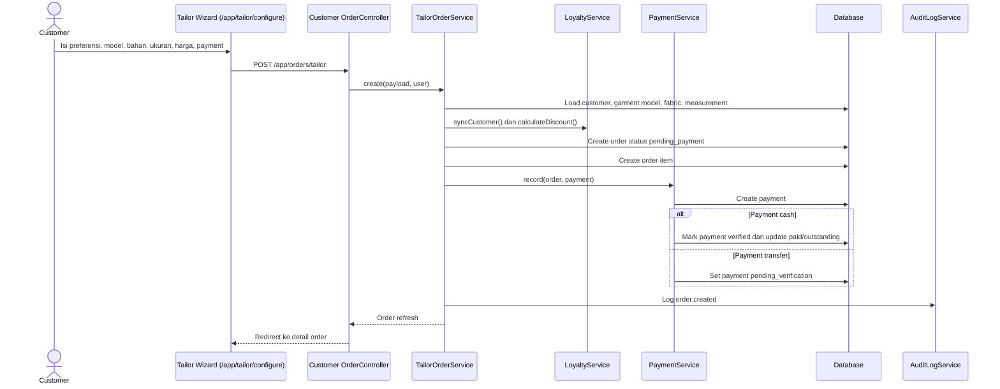

## 10. Sequence Diagram - Ready-to-Wear Checkout

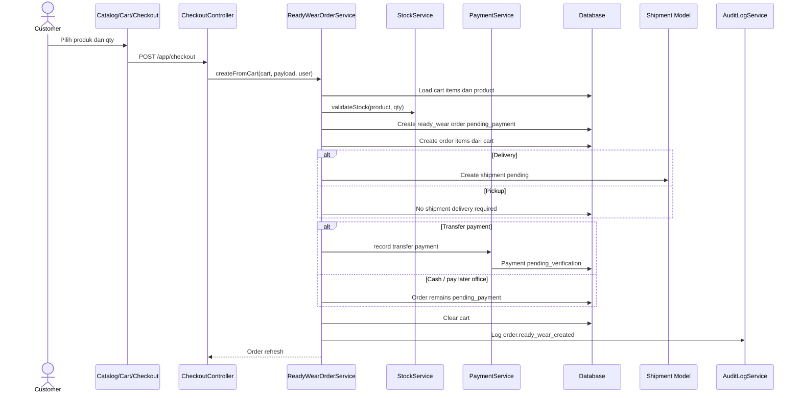

## 11. Sequence Diagram - Konveksi Full Payment

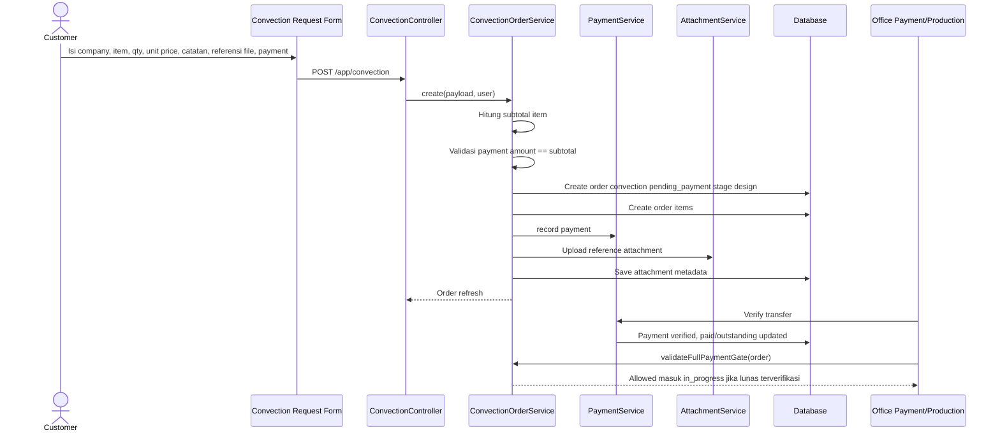

## 12. Sequence Diagram - Verifikasi Payment oleh Kasir

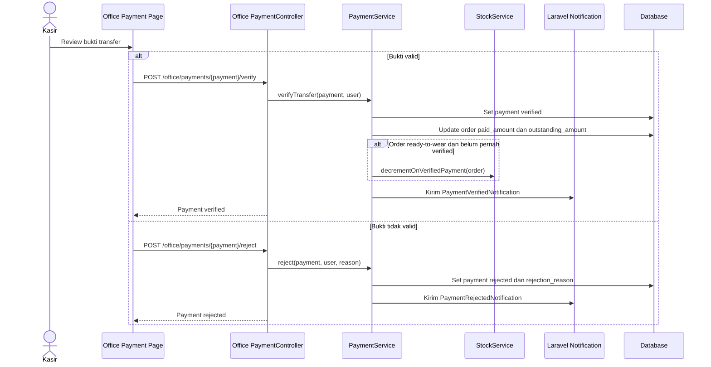

## 13. Sequence Diagram - Produksi dan Shipping

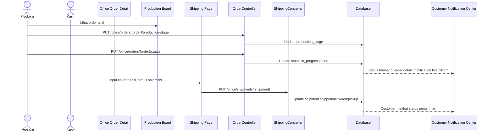

## 14. Activity Diagram (Swimlane) - Customer Order Flow

> **Format swimlane UML.** Setiap kolom (lane) merepresentasikan satu aktor; alur aktivitas mengalir dari atas ke bawah dalam masing-masing lane dan berpindah antar lane saat terjadi handoff tanggung jawab.
>
> **Aktor (lane):** Customer · System · Office (Kasir / Produksi / Pengiriman)

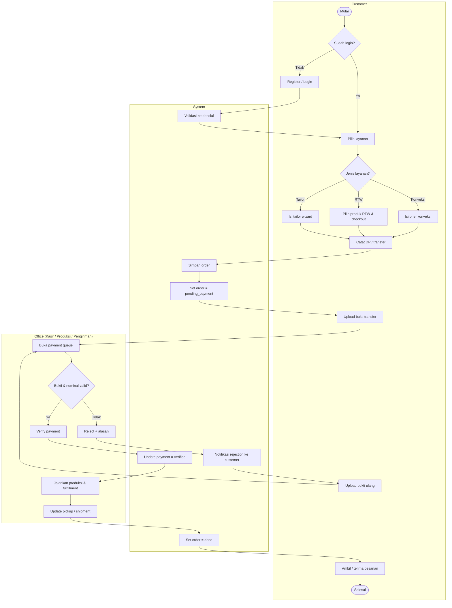

## 15. Activity Diagram (Swimlane) - Office Payment Verification

> **Aktor (lane):** Customer · System · Kasir

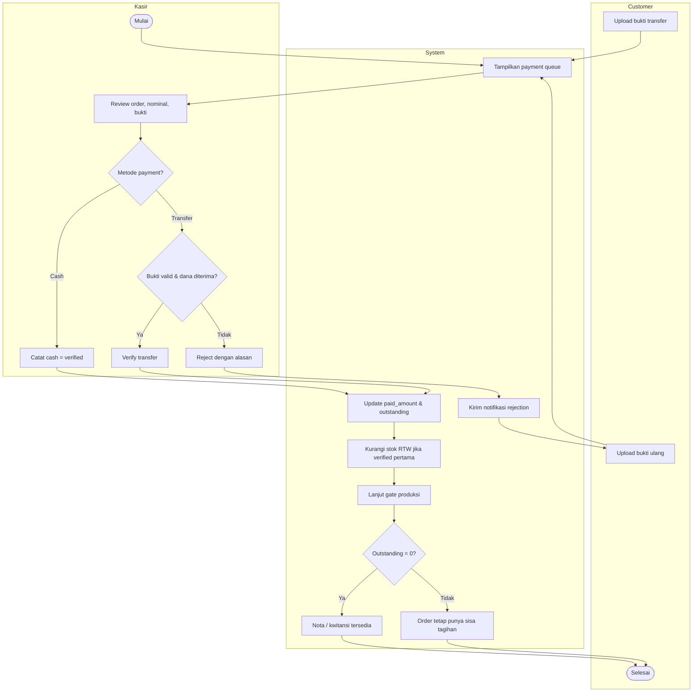

## 16. Activity Diagram (Swimlane) - Production and Fulfillment

> **Aktor (lane):** Customer · System · Office (Produksi / Pengiriman)

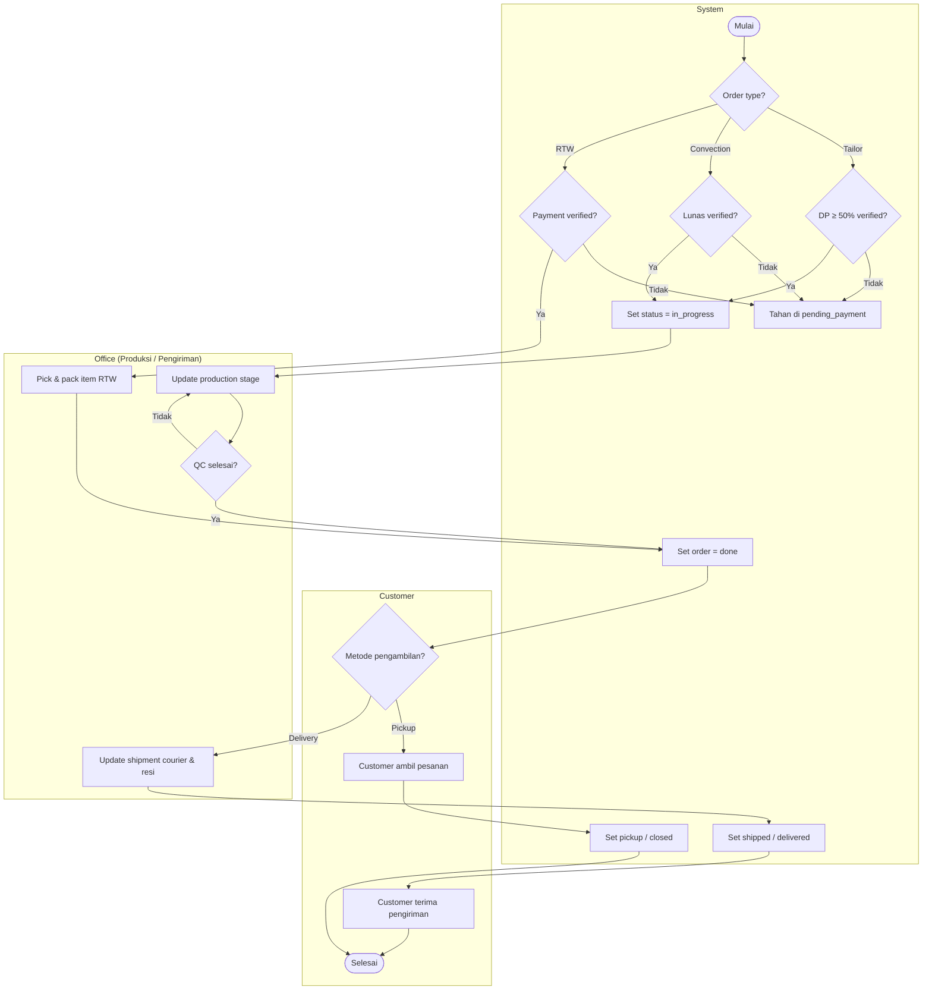

## 17. Status Route MVP

| Surface | Route Utama | Fungsi |
| --- | --- | --- |
| Customer public | `/app`, `/app/catalog`, `/app/services/*`, `/app/tailor/configure` | Landing customer, katalog, service page, wizard tailor |
| Customer auth | `/app/dashboard`, `/app/profile`, `/app/addresses`, `/app/measurements` | Dashboard dan profile center |
| Customer orders | `/app/orders`, `/app/orders/{order}`, `/app/orders/tailor`, `/app/convection` | Riwayat, detail, tailor, konveksi |
| Customer cart/checkout | `/app/cart`, `/app/checkout` | RTW commerce |
| Customer payment | `/app/payments`, `/app/orders/{order}/payments`, `/app/payments/{payment}/proof` | Payment history dan upload proof |
| Customer notification | `/app/notifications` | Notification center |
| Office dashboard | `/office/dashboard` | Ringkasan operasional |
| Office orders | `/office/orders`, `/office/orders/{order}`, `/office/orders/tailor/create` | Order list, detail, manual tailor |
| Office payments | `/office/payments`, verify/reject, kwitansi | Queue pembayaran dan dokumen |
| Office production | `/office/production` | Production board |
| Office shipping | `/office/shipping`, `/office/shipments/{shipment}` | Shipment management |
| Office reports | `/office/reports`, `/office/reports/export` | Report dan export |
| Office audit | `/office/audit-log` | Audit trail |
| Admin | `/office/admin/users`, products, garment-models, fabrics, couriers, discounts | Master data dan policy |

## 18. MVP Acceptance Criteria

| Area | Acceptance Criteria |
| --- | --- |
| Auth & Role | Customer tidak bisa akses `/office`; staff office tidak diperlakukan sebagai customer portal |
| Customer Profile | Customer dapat menyimpan alamat default dan measurement untuk order berikutnya |
| Tailor | Customer atau kasir dapat membuat tailor order hanya jika DP awal minimal 50%; payment tercatat; order muncul di office |
| Ready-to-Wear | Customer dapat checkout cart; stok hanya turun setelah payment verified |
| Ready-to-Wear Delivery | Ongkir berasal dari master courier dan dicatat ke order/shipment tanpa fee tambahan hardcoded |
| Convection | Customer hanya bisa submit jika total item valid dan full payment sesuai total |
| Payment | Transfer bisa verified/rejected; rejection reason tersimpan; customer bisa upload ulang proof |
| Production | Office dapat update status dan stage produksi sesuai gate pembayaran |
| Shipping | Office dapat mengisi courier, resi, dan status shipment |
| Documents | Nota/kwitansi tersedia hanya untuk transaksi yang valid sesuai rule |
| Report & Audit | Admin/owner dapat melihat report dan audit log perubahan penting |

## 19. Risiko dan Cleanup Non-Blocking

| Item | Dampak | Rekomendasi |
| --- | --- | --- |
| Field quotation legacy masih ada di `orders` | Tidak muncul di flow aktif, tetapi bisa membingungkan developer baru | Dokumentasikan sebagai kompatibilitas lama atau cleanup setelah data production stabil |
| Transfer manual masih bergantung pada SOP kasir | Risiko human error | Buat checklist kasir dan audit rutin harian |
| Courier/shipping belum integrasi API ekspedisi | Tracking belum otomatis | Masuk roadmap post-MVP, bukan blocker narasi |
| Payment gateway belum otomatis | Verifikasi masih manual | Masuk roadmap jika volume transaksi meningkat |
| Testing harus dijaga setelah perubahan besar | Readiness lama bisa kadaluarsa | Jalankan `php artisan test --compact`, `npm run build`, dan type check sebelum go-live |

## 20. Rekomendasi Go-Live MVP

1. Gunakan MVP untuk operasi terbatas terlebih dahulu, misalnya customer internal atau customer terpilih.
2. Kunci SOP kasir: transfer baru verified setelah dana diterima atau bukti valid sesuai catatan bisnis.
3. Kunci SOP produksi: tailor minimal DP 50% verified, konveksi lunas verified sebelum produksi.
4. Kunci SOP shipping: resi dan status wajib diinput sebelum order dianggap shipped/delivered.
5. Jalankan verifikasi teknis sebelum release: backend test, frontend build, storage link, mail/notification, APP_URL, backup database.
6. Buat backlog post-MVP untuk payment gateway, ekspedisi API, inventory lanjutan, dan accounting.

## 21. Verdict Akhir

Berdasarkan PRD dan struktur app saat ini, Djaitin sudah memenuhi bentuk **MVP aplikasi SIM Convection Taylor**:

| Pertanyaan | Jawaban |
| --- | --- |
| Apakah sudah bisa menjadi MVP? | Ya, untuk MVP operasional dengan scope terkontrol |
| Apakah sudah mirip docs/PRD? | Ya, mayoritas surface dan business rule inti sudah selaras |
| Apakah sudah production mature? | Belum sepenuhnya; perlu go-live checklist, SOP, backup, dan QA final |
| Apakah ada fitur berlebihan yang menghalangi? | Tidak. Fitur modern diposisikan sebagai pendukung UX, bukan flow bisnis inti |

Dokumen ini dapat dipakai sebagai acuan visual dan teknis untuk menjelaskan MVP kepada stakeholder, dosen/penguji, tim developer, atau tim operasional.
