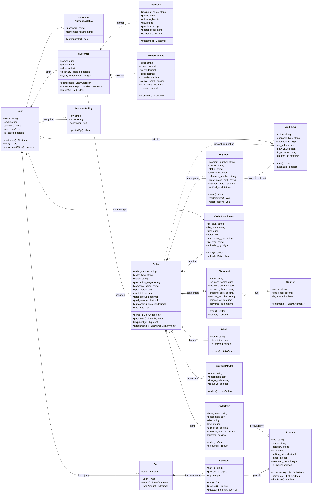

# Class Diagram Djaitin

Diagram ini disusun berdasarkan model, migration, service, dan elisitasi final sistem Djaitin.

## Catatan Notasi

- `*--` menunjukkan komposisi, yaitu class target sangat bergantung pada class sumber.
- `o--` menunjukkan agregasi, yaitu class target digunakan sebagai bagian/referensi tetapi tetap dapat berdiri sendiri.
- `-->` menunjukkan asosiasi biasa.
- `..>` menunjukkan dependency atau pencatatan tidak langsung.
- Multiplicity mengikuti relasi Eloquent dan foreign key pada migration.
