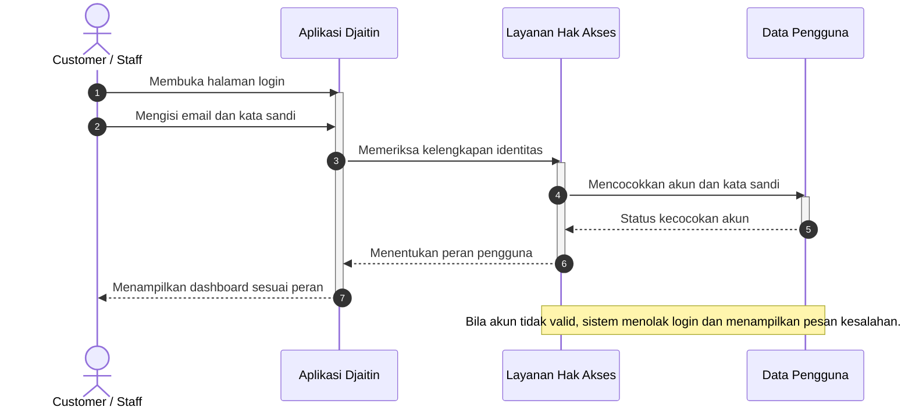
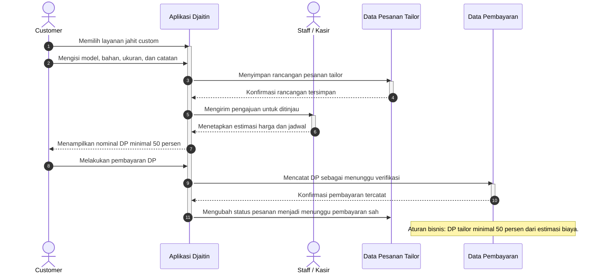
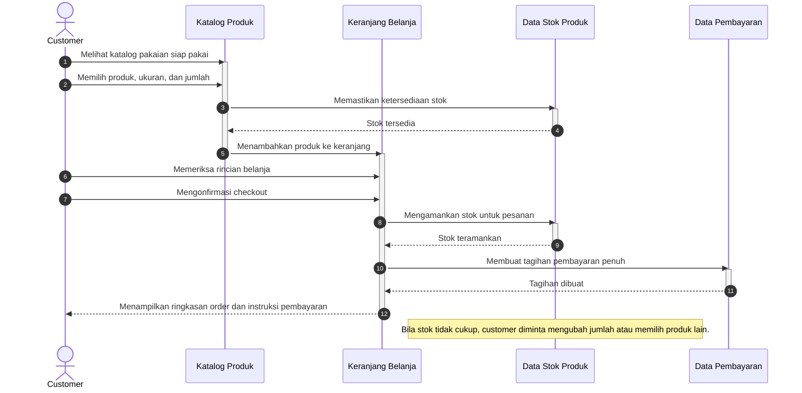
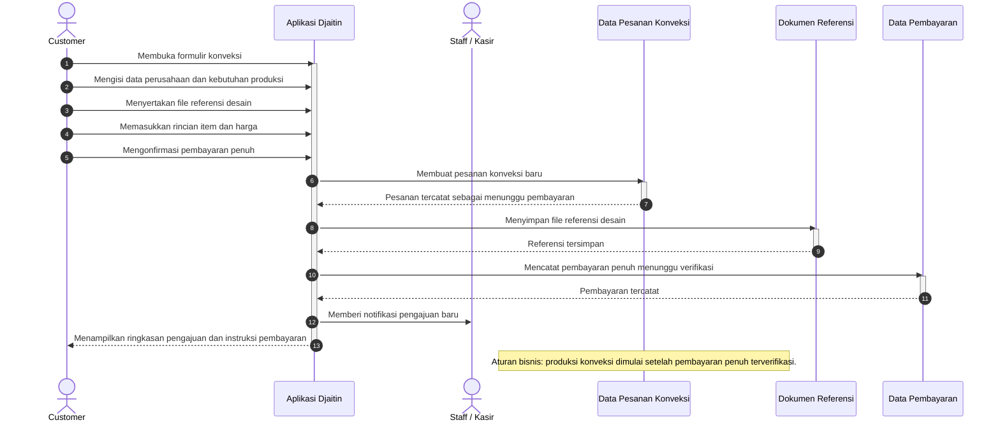
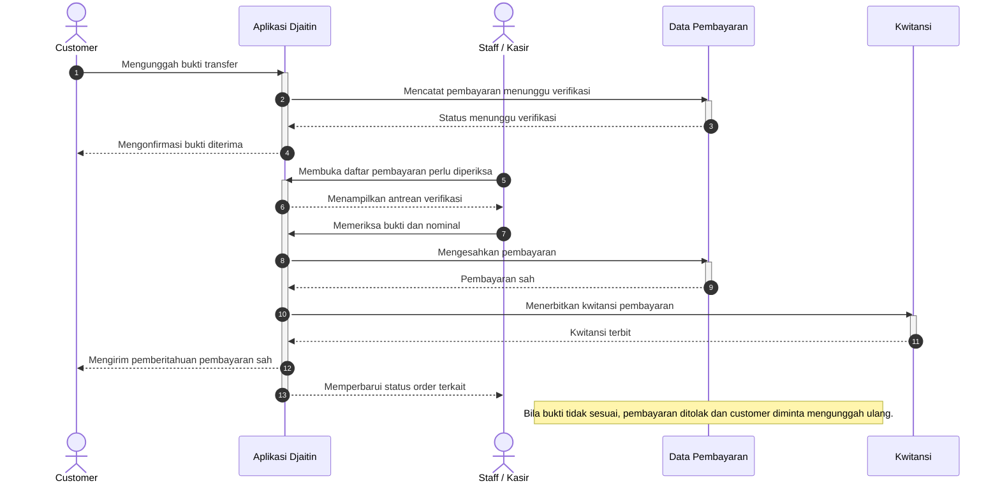
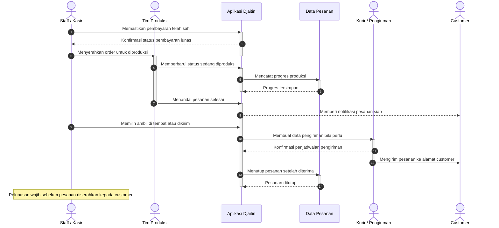

# Sequence Diagram Djaitin

Diagram interaksi disusun berdasarkan controller, service, dan elisitasi final sistem Djaitin. Setiap pesan ditulis dalam bahasa bisnis agar mudah dibaca lintas peran.

## SD-1 Login Pengguna

## SD-2 Order Tailor dan Pembayaran DP

## SD-3 Checkout Ready-to-Wear

## SD-4 Pengajuan Order Konveksi

## SD-5 Verifikasi Pembayaran

## SD-6 Produksi dan Pengiriman

## Catatan Pembacaan

- `actor` digunakan untuk peran manusia, baik customer maupun staf internal.
- `participant` digunakan untuk komponen sistem, baik aplikasi, layanan, maupun gudang data.
- Pesan utama digambar dengan panah penuh, sedangkan balasan digambar dengan panah putus-putus.
- Bar aktivasi dihasilkan otomatis oleh `activate` dan `deactivate` agar partisipan terlihat aktif selama menangani pesan.
- Penomoran otomatis dengan `autonumber` membantu rujukan langkah pada laporan.
